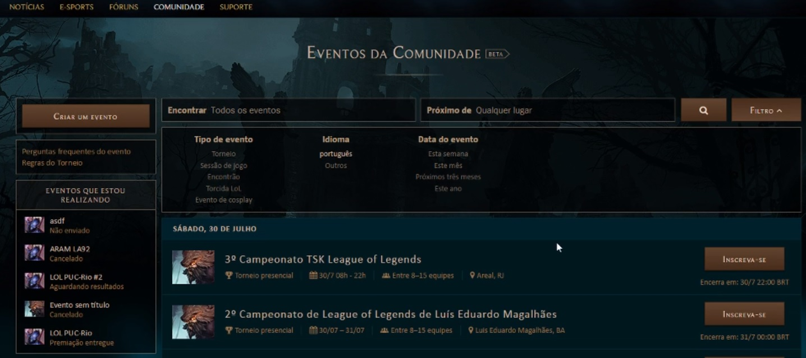
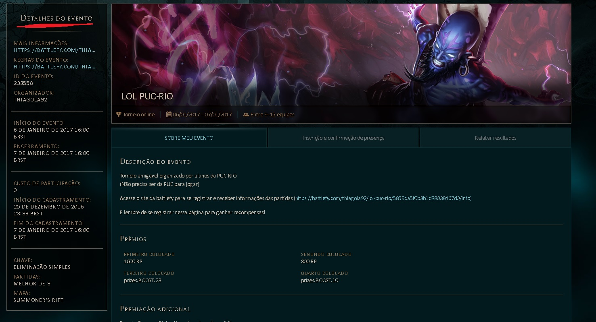
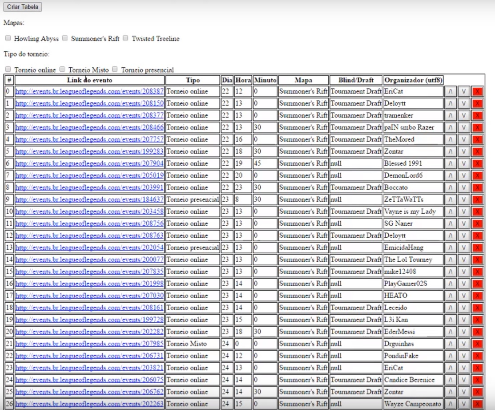

# Warning
Hoje em dia acredito que esse crawler seja inútil, pois nem o site de eventos parece estar funcionando bem e Riot decidiu por adotar outras maneiras de torneio (torneio universitário).

# Get-Tournaments
Um crawler, programa que entra em um site/página e pega informações lendo o código fonte dela.  
Esse crawler foi feito para pegar informações de torneio do site do League of Legends Brasil (http://events.br.leagueoflegends.com/) pois o site em si não filtrava bem o que eu procurava.  

Para esse projeto utilizei **Python** e **Selinium webdriver**.  

# How it works

  

Nessa imagem você pode notar que as opções de filtro são:  
* Evento com nome X
* Localização
* Tipo do evento (torneio/sesão de jogo/encontrão/torcida lol/evento cosplay)
* Idioma (como o site é brasileiro só vai sugerir português)
* Data do evento (semana, mês, ano, próximos 3 meses)

As principais informações que procuravamos olhando torneio:  
* Em qual mapa seria o Torneio: Summoner Rift's, Twisted Treeline ou Howling Abyss.  
* Qual seria o tipo do torneio: Online, Misto ou Presencial.  
* Se o evento vai usar o site https://battlefy.com/ para organizar o torneio **(importante pegar o link do torneio no battlefy)**    
* Data do evento: dia, mês, hora. **(importante para não registrar em torneios no mesmo horário)**  
* Organizador do evento. **(importante pois existiam organizadores que roubavam RP para eles)**  

Essas informações só se encontravam após entrar nos links da lista de eventos (entrar em 30 links para encontrar os 5 que te interessam era bem chato).  

  

A informação era coletada olhando o código HTML da página, ou seja, se algum modelo do código fosse alterado com o tempo, eu teria que dar update no código.  
Após toda a informação ser coletada, eu armazenava em um arquivo javascript (um array com varias estruturas com as informações do evento).  
Para finalizar um botão que criava uma tabela em HTML com as informações bem organizadas.  

  

